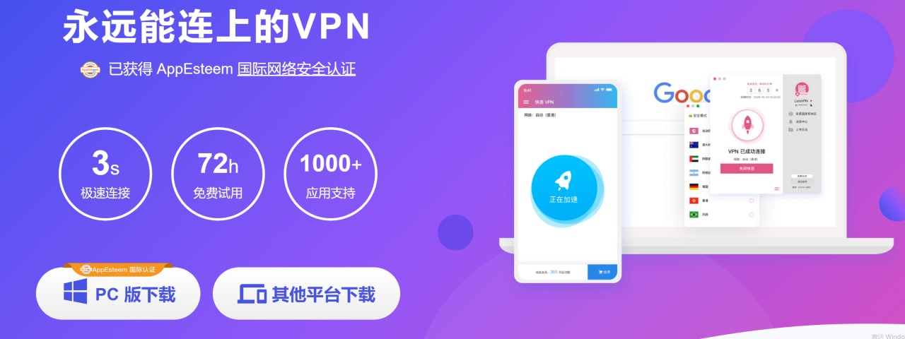

# 快连VPN深度解析：使用体验、安全性与是否为钓鱼软件全解答

最新更新：2025年7月1日

快连VPN近年来成为网络讨论的焦点，被不少用户称为“总能连得上的VPN”，以其连接稳定和速度快广受好评。不过，关于它的运营背景和安全性，也存在许多疑问，比如快连VPN到底属于哪个国家？它是否安全？有没有钓鱼风险？本文将多角度评测快连VPN，从背景、技术、安全、使用体验和价格等方面，帮助你全面了解这款VPN产品，理性选择适合自己的VPN服务。

## 
一键“快连”，纵享丝滑

快连 VPN 采用全新内核，AI 智能连接，自动为您匹配全球最快的网络节点，只需要轻点“开启快连”，3秒之内，纵享丝绸般顺滑的冲浪体验。

<a href="https://chawacha.com/show/42.html" target="_blank">立即体验   了解更多</a>

## 快连VPN运营国家揭秘

许多用户关心快连VPN的归属地。公开资料显示，快连VPN不是中国本土开发，而由海外华人团队在加拿大温哥华运营，主要服务亚洲尤其是中国大陆用户。其产品特性，如简体中文界面与本地化支付方式，也充分考虑了中国用户需求。也就是说，虽然公司设在海外，快连VPN本质上是一款为中国市场量身定制的VPN。

不过需要注意，加拿大属于“五眼联盟”国家之一。五眼联盟成员国之间存在数据共享协议，加拿大政府在特定情况下有权要求快连VPN交出用户数据，并可能与其他成员国共享。因此，快连VPN在隐私层面并非绝对安全，用户的数据存在被政府调阅的潜在风险。

接下来，我们将从加密技术、隐私政策和实际体验出发，客观分析快连VPN的优劣，助你做出明智决策。

## 快连VPN是否为钓鱼软件？

关于“快连VPN是钓鱼软件吗”的疑虑很常见。钓鱼软件一般指伪装成正常应用，实则窃取用户隐私的恶意程序。

目前公开信息中，并没有直接证据显示快连VPN存在钓鱼行为。快连VPN的客户端可通过其官网及各大应用商店下载，未发现明显的恶意代码或钓鱼特征。虽然有部分用户对隐私和数据安全表达担忧，但尚无证据证明快连VPN会恶意收集敏感信息。另外，虽然快连VPN总部在加拿大，理论上在法律要求下需配合政府数据调阅，但这属于行业合规问题，与钓鱼软件的定义不同。

综上，快连VPN目前没有被证实为钓鱼软件。对于高度关注隐私的用户，建议选择更透明、口碑更佳的VPN服务。更多可靠VPN推荐见：<a href="https://sg2025.shop/">翻墙软件推荐</a>。

## 快连VPN实际体验如何？

快连VPN的广告铺天盖地，不少用户反馈其翻墙表现稳定、支持多平台和多设备、界面友好、客服服务和解锁流媒体能力较强。网络评价中常见优点包括：

<blockquote>

* 全球27+国家/地区、3000+服务器，覆盖美欧亚多地
* 支持Netflix、Hulu、BBC iPlayer等流媒体解锁
* 允许BT下载，适合P2P需求
* 兼容Windows、Mac、iOS、Android等主流平台
* 单账号最多可同时连接5台设备
* 界面简洁、操作简单，适合新手
* 24小时在线客服与FAQ帮助资源
* 3天免费试用及退款保障

</blockquote>

<a href="https://chawacha.com/show/42.html" target="_blank">立即体验   了解更多</a>

但实测与用户反馈发现，快连VPN实际表现不如宣传理想。例如，Netflix等流媒体解锁效果并不稳定，高峰期速度容易波动，GFW升级时偶有无法连接的情况。客服虽承诺24小时在线，但响应速度慢、问题解决效率低。

小结：快连VPN有一定优势，但真实体验与官方宣传有差距。建议用户谨慎评估，结合自身需求和使用场景选择VPN。更多优质VPN推荐请参见<a href="https://sg2025.shop/">中国VPN推荐</a>。

## 快连VPN的安全性分析

分析快连VPN的安全性，需关注隐私政策、加密协议、服务器部署及数据请求响应机制等。

快连VPN宣称不记录用户浏览活动和连接日志，理论上提升了隐私保护。但总部位于加拿大，作为“五眼联盟”成员国仍存在合规数据调阅风险。

技术上，快连VPN采用OpenVPN和IKEv2等主流高强度加密协议，保障数据传输安全。不过其官网未披露详细加密实现和具体安全措施，实际安全性难以完全验证。对于服务器数据存储和日志政策，快连VPN未明确说明是否采用无日志/只读RAM服务器等先进技术，这方面相对不透明。

综上，快连VPN在安全和隐私承诺上表现普通，部分细节不够公开透明。对于极度重视数据安全的用户，建议优先考虑安全性更高、政策更透明的VPN服务。

## 快连VPN价格及退款政策

快连VPN提供月付、季付和年付三种订阅方式，满足不同预算需求：

* 月付：4.69美元，适合短期使用
* 季付：10.99美元，性价比高
* 年付：39.99美元，平均月费最低，适合长期用户

快连VPN承诺24小时客服支持，官网有FAQ和帮助资源，但实际客服响应速度有待提升。

退款方面，快连VPN提供3天免费试用，试用后若不满意可按官网政策申请退款。具体退款条件和流程因地区政策略有不同，购买前建议详细阅读官网条款，避免后续纠纷。

总体来看，快连VPN价格合理，但与国际知名VPN相比，性价比与服务仍有提升空间。推荐优先考虑如下两款高性价比VPN：

<a href="https://sg2025.shop/">ExpressVPN – 稳定高速，30天免费试用</a>

<a href="https://sg2025.shop/">PureVPN – 安全可靠，月均仅2.11美元</a>

## 快连VPN支持哪些协议？

快连VPN主要支持OpenVPN和IKEv2两大主流协议：

* **OpenVPN**：开源、安全性高，支持TCP/UDP两种传输方式，适合对数据安全有较高要求的用户。
* **IKEv2**：连接快速、稳定，尤其适合移动端，在网络切换场景下表现优异，低延迟需求下效果更佳。

用户可根据自身需求和网络环境选择合适协议。不过，快连VPN未详细披露加密强度和协议实现细节，实际体验仍需结合个人隐私需求予以评估。

## 快连VPN有流量限制吗？

官方信息显示，快连VPN宣称不限制流量，用户可畅享高速网络，无论是看视频还是下载大文件都不受限。不限流量的设计，对有大量流量需求或长时间翻墙的用户十分友好。

但需注意，高峰时段因服务器负载，网速可能会下降，这并非主动限速，而是资源分配导致的体验波动。

## 快连VPN可以免费使用吗？

快连VPN为新用户提供3天免费试用，无需支付即可体验全部核心功能。试用期后，如果满意可订阅，若不满意可取消且不产生费用。付费后仍享有一定期限的退款保障。

免费试用功能或许与付费版略有区别，建议详细了解试用与正式版的差异和自动续费条款，避免不必要的消费，快连vpn下载。

## 评测总结：快连VPN值得信赖吗？

综合评测，快连VPN能满足部分用户的基本翻墙需求，在连接、解锁、兼容性和客服等方面有一定优势。但实际表现与宣传有差距，流媒体解锁和高峰期速度稳定性一般，隐私保护细节不够透明。对于普通用户，快连VPN基本可用；但对隐私和解锁要求高的用户，建议关注更专业的VPN产品：

<a href="https://sg2025.shop/show/1.html">ExpressVPN – 跨国访问更稳定，速度更快，30天免费试用</a>

<a href="https://sg2025.shop/show/5.html">PureVPN – 价格实惠，安全性好，月付仅2.11美元</a>

<a href="https://chawacha.com/show/42.html" target="_blank">快连VPN下载</a>

---

## 快连VPN相关延伸阅读：

* <a href="https://weixincha.cyou/show/56.html">科学上网指南</a>：介绍主流翻墙方法及推荐优质VPN/软件。
* <a href="https://weixincha.cyou/show/57.html">中国VPN排行</a>：大陆实测推荐，稳定可用VPN清单。
* <a href="https://weixincha.cyou/show/42.html">回国VPN推荐</a>：海外华人如何方便获取大陆IP。
* <a href="https://weixincha.cyou/show/14.html">电脑VPN推荐</a>：适合PC端的高效翻墙方案。
* <a href="https://weixincha.cyou/show/10.html">苹果VPN推荐</a>：iOS翻墙与Apple ID购买指南。
* <a href="https://tianyancha.cyou/show/7.html">安卓VPN推荐</a>：安卓手机VPN使用及推荐。
* <a href="https://tianyancha.cyou/show/4.html">路由器VPN推荐</a>：路由器设置翻墙教程和推荐。
* <a href="https://tianyancha.cyou/show/9.html">便宜VPN推荐</a>：中国可用的高性价比VPN。
* <a href="https://tianyancha.cyou/show/14.html">免费VPN推荐</a>：免费VPN优缺点与精选推荐。
* <a href="https://tianyancha.cyou/show/10.html">ExpressVPN中国评测</a>：ExpressVPN在中国的效果详解。
* <a href="https://tianyancha.cyou/show/16.html">StrongVPN中国评测</a>：StrongVPN使用体验与问题解答。
* <a href="https://tianyancha.cyou/show/3.html">PureVPN中国评测</a>：PureVPN在中国表现及相关问题。
* <a href="https://tianyancha.cyou/show/11.html">快帆VPN评测</a>：快帆VPN安全性与使用方式。
* <a href="https://tianyancha.cyou/show/13.html">老王VPN怎么样</a>：老王VPN安全性及替代方案。
* <a href="https://tianyancha.cyou/show/15.html">Telegram注册</a>：电报注册与常见问题解决。
* <a href="https://tianyancha.cyou/show/19.html">GPT Plus充值</a>：ChatGPT Plus会员开通和合租攻略。
* <a href="https://tianyancha.cyou/show/21.html">油管视频下载</a>：最佳Youtube下载工具推荐。
* <a href="https://tianyancha.cyou/show/22.html">翻墙后看什么</a>：优质国外网站推荐。
* <a href="https://tianyancha.cyou/show/18.html">国外视频网站</a>：热门海外视频平台汇总。
